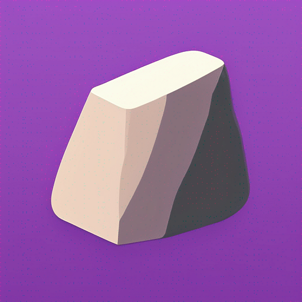

<p align="center">
  
</p>

# Climbing Log

A webapp for tracking your rock-climbing sessions.

## Features

- ➕ Create new bouldering areas, crags and boulders - with support for [FB and V grades](https://www.mountainproject.com/international-climbing-grades).
- 🗺️ Display all your boulders on a map.
- ✅ Log your climbing ascents.
- ✍️ AddTake notes about your session.
- 📸 Link photos, videos and pdf files from a file-hosting instance (currently only supports [Nextcloud](https://github.com/nextcloud)).
- 📈 Display your climbing history and statistics about your ascents.
- 🚀 Easy self-hosting with Docker and docker-compose.

## Installation

- If you have `ignore-scripts=true` in your `.npmrc` you need to install and build `better-sqlite3` manually:

  ```bash
    npm install
    cd node_modules/better-sqlite3
    npm install
    npm run build-release
  ```

- Copy [`.env.example`](./.env.example) to `.env` and fill in the info about your Nextcloud instance.
- If no `sqlite` database file exists in the root of the project, a new one will be created upon starting the app. Then run

  ```bash
    npm run generate
    npm run migrate
  ```

## License

This project is licensed under the MIT License - see the [LICENSE](LICENSE) file for details.
